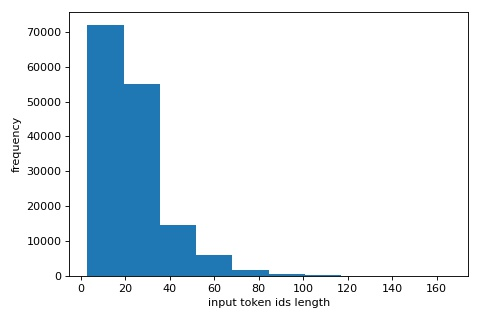
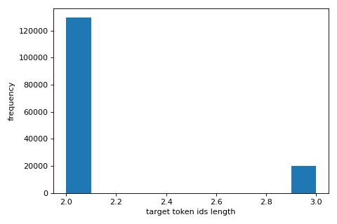
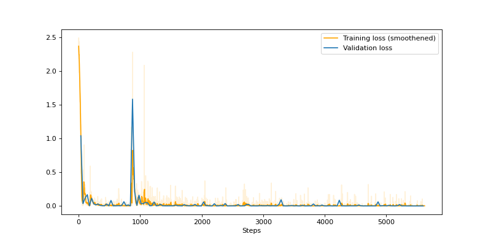

# MT5_Language_Identifier

1. [ Introduction. ](#intro) 
     1.1 [ Text-to-Text Transfer Transformer (T5). ](#t5) 
     1.2 [ Multilingual T5. ](#mt5)
2. [ Fine-tuning MT5. ](#finetune) 
     2.1 [ Data preparation. ](#dp) 
     2.2 [ Encoding configuration. ](#ec) 
     2.3 [ Training results. ](#tr) 
     2.4 [ Model Testing and Discussion. ](#mt) 
3. [ Tips to run the code. ](#tips) 

## 1. Introduction

## 1.1 Text-to-Text Transfer Transformer (T5)

[T5](https://arxiv.org/pdf/1910.10683.pdf) is a pre-trained language model whose primary distinction is its use of a unified “text-to-text” format for all text-based NLP problems. 

This approach is natural for generative tasks where the task format requires the model to generate text conditioned on some input. It is more unusual for classification tasks, where T5 is trained to generate the literal text of the class label instead of a class index. The primary advantage of this approach is that it allows the use a single set of hyperparameters for effective fine-tuning on any downstream task.

T5 uses a basic [encoder-decoder Transformer](https://arxiv.org/pdf/1706.03762.pdf) architecture. T5 is pre-trained on C4 Common Crawl dataset using BERT-style masked language modeling “span-corruption” objective, where consecutive spans of input tokens are replaced with a mask token and the model is trained to reconstruct the masked-out tokens.

The authors trained 5 different size variants of T5: small model, base model, large model, and models with 3 billion and 11 billion parameters.

## 1.2 Multilingual T5

[MT5](https://arxiv.org/pdf/2010.11934.pdf) is a multilingual variant of T5 that was pre-trained on a new Common Crawl-based mC4 dataset covering 101 languages. MT5 pre-training uses suitable data sampling strategies to boost lower-resource languages, and to avoid over and under fitting of the model. Similar to T5, MT5 casts all the tasks into the text-to-text format.

Similar to T5, the authors trained 5 different size variants of MT5: small model, base model, large model, XL, and XXL model. The increase in parameter counts compared to the corresponding T5 model variants comes from the larger vocabulary used in mT5.

## 2. Fine-tuning MT5

[MT5-small](https://console.cloud.google.com/storage/browser/t5-data/pretrained_models/mt5/small?pli=1) is fine-tuned on a new task of predicting the language a given text is written in, using the [XNLI](https://github.com/facebookresearch/XNLI) dataset, which contains text in 15 languages. The XNLI 15-way parallel corpus consists of 15 tab-separated columns, each corresponding to one language as indicated by the column headers. The column headers, each representing a language is given below,

ar: Arabic 
bg: Bulgarian 
de: German 
el: Greek 
en: English 
es: Spanish 
fr: French 
hi: Hindi 
ru: Russian 
sw: Swahili 
th: Thai 
tr: Turkish 
ur: Urdu 
vi: Vietnamese 
zh: Chinese (Simplified) 

These column headers are used as the target text during fine-tuning. MT5 models are supported by [Hugging Face transformers](https://huggingface.co/transformers/model_doc/mt5.html) package, and the details about model evaluation and fine-tuning can be found in the documentation.

## 2.1 Data Preparation

The [xnli  dataset](dataset/xnli15.tsv) is cleaned and then prepared as a two-column data frame, with the column headers 'input_text' and 'target_text'. Since MT5 is a text-to-text model, to specify which task the model should perform, a prefix text is added to the original input sequence before feeding it. The prefix helps the model better when fine-tuning it on multiple downstream tasks, e.g., machine translation between many languages. The prefix <idf.lang> is added as a special token to the tokenizer. As stated in the [documentation](https://huggingface.co/transformers/main_classes/model.html#transformers.PreTrainedModel.resize_token_embeddings), if the new number of tokens is not equal to the model.config.vocab_size, then resize the input token embeddings matrix of the model. A few of the prepared training samples are shown below,

| input_text                                                                                                | target_text   |
|:----------------------------------------------------------------------------------------------------------|:--------------|
| <idf.lang> सांप नदी सांपों  से भरा है।                                                                         | hi            |
| <idf.lang> Anaokulu öğrencilerinin taklit yapma konusunda o kadar fazla yardıma ihtiyaçları yok.          | tr            |
| <idf.lang> Важно показать пределы данных, или люди сделают плохие выводы, которые уничтожат исследование. | ru            |
| <idf.lang> Музеят е в близост до египетския музей.                                                        | bg            |
| <idf.lang> O Mungu kwa sababu jina jina tu nimelisahau lakini ni Amani ya Bunge                           | sw            |

## 2.2 Encoding Configuration

[T5 paper](https://arxiv.org/pdf/1910.10683.pdf) (source) : " *There are some extra parameters in the decoder due to the encoder-decoder attention and there are also some computational costs in the attention layers that are* ***quadratic in the sequence lengths*** "

Since the input and target token id lengths are task-specific, the distribution of the token id lengths of the dataset needs to be first analyzed. Decent values need to be chosen for sequence lengths without requiring high computational power.

  
   

- The maximum input sequence length is set to 40.
- The maximum target sequence length is set to 3.
- truncation=True truncates the sequence to a maximum length specified by the max_length argument.
- padding='max_length' pads the sequence to a length specified by the max_length argument.

## 2.3 Training Results

The optimizer used is AdamW with the learning rate 5e-4. The learning rate scheduler used is a linear schedule with a warmup, which creates a schedule with a learning rate that decreases linearly from the initial learning rate set in the optimizer to 0, after a warmup period during which it increases linearly from 0 to the initial learning rate set in the optimizer. Warmup is a way to reduce the primacy effect of the early training examples. The training and the validation losses computed during fine-tuning are plotted in the below graph,

## 2.4 Model Testing and Discussion

**Model Test Accuracy: 99.49%**

The model is tested on 10,000 examples, out of which only 51 are wrongly predicted. To understand better, let's try to take a close look at the wrong predictions. All the wrong predictions are listed in the table below.

|    | Input_text                                                                                                                                          | True_target   | Predicted   |
|---:|:----------------------------------------------------------------------------------------------------------------------------------------------------|:--------------|:------------|
|  00 | <idf.lang> andaroni circle ki membership muft nahi hai.                                                                                             | ur            | hi          |
|  01 | <idf.lang> aisa lag raha tha k ye hmaisha k liye hai.                                                                                               | ur            | hi          |
|   02 | <idf.lang> Brock no defiende a Hillary.                                                                                                             | es            | en          |
|  03 | <idf.lang> Huevos means balls.                                                                                                                      | en            | th          |
|   04 | <idf.lang> До свидания!                                                                                                                             | ru            | bg          |
|   05 | <idf.lang> Той прегърна широко лорд Джулиан.                                                                                                        | bg            | ru          |
|   06 | <idf.lang> Mujhe aik glass chocolate ka doodh chahiye                                                                                               | ur            | hi          |
|   07 | <idf.lang> (a) Променете всяко d или t в целта до c.                                                                                                | bg            | ru          |
|  08 | <idf.lang> aur aisa hi tha jaise wo ise mustarad kar rahi thi, kuch tareqon se, jis trha se isne apke sath bartao kiya, dosre nawase.               | ur            | hi          |
|   09 | <idf.lang> Кальдас де Мончик окружен лесами.                                                                                                        | ru            | bg          |
|  10 | <idf.lang> Yahan pr buht zyada IT workers han.                                                                                                      | ur            | hi          |
|   11 | <idf.lang> Cambridge'den.                                                                                                                           | tr            | en          |
|  12 | <idf.lang> Mosam kafi acha hai or barish wala hai.                                                                                                  | ur            | hi          |
| 13 | <idf.lang> Koleksiyonda on iki makale var.                                                                                                          | tr            | vi          |
| 14 | <idf.lang> خدا حافظ!                                                                                                                                | ur            | ar          |
|  15 | <idf.lang> Aik cheez jo M. Tesnaires nai khaya nahi kya, woh, Anglo-Saxon ka input hah.                                                             | ur            | hi          |
|  16 | <idf.lang> Mera ek Credit Union hai, jiske paas mai jaa sakta hu                                                                                    | hi            | ur          |
|  17 | <idf.lang> FAA ki traffic control k data ka tajzeea kiya gya tha.                                                                                   | ur            | hi          |
| 18 | <idf.lang> sasty aur dhokay wali masnoa'at.                                                                                                         | ur            | sw          |
|  19 | <idf.lang> Биеннале Венеции перенаселено.                                                                                                           | ru            | bg          |
| 20 | <idf.lang> Curanderas heilen oft caida de mollera.                                                                                                  | de            | bg          |
|  21 | <idf.lang> Бих избрал  I'll Fly Away.                                                                                                               | bg            | ru          |
|  22 | <idf.lang> Беги и кричи.                                                                                                                            | ru            | bg          |
| 23 | <idf.lang> अलविदा!                                                                                                                                  | hi            | ur          |
|  24 | <idf.lang> Давай продолжим разговор.                                                                                                                | ru            | bg          |
|  25 | <idf.lang> James Wilson Marshall ne kuch khas nahi kiya.                                                                                            | ur            | hi          |
| 26 | <idf.lang> Je choisirai I'll Fly Away                                                                                                               | fr            | en          |
| 27 | <idf.lang> Sielewi hoja hio.                                                                                                                        | sw            | ur          |
|  28 | <idf.lang> Ek insaan ne sare jawano ko mansik santulan diya                                                                                         | hi            | ur          |
|  29 | <idf.lang> Meri dadi hamasha apne bachpan ke baray mein baat kerne ki lye inkaar kar deti thein.                                                    | ur            | hi          |
|  30 | <idf.lang> aur hum, Las Vegas, NV mai aik adress par move hogaye hian, jaisa ke humne Washington mai kiya tah.                                      | ur            | hi          |
| 31 | <idf.lang> si...si..sikuota.                                                                                                                        | sw            | ur          |
| 32 | <idf.lang> Αντίο!                                                                                                                                   | el            | ar          |
|  33 | <idf.lang> Ye aik bura tasur daita hai agr ap karkanon ko ye dekhain k unki awazein nahi suni ja rahin.                                             | ur            | hi          |
|  34 | <idf.lang> Congress insadad e dehshat gardi ki nigran hai.                                                                                          | ur            | hi          |
|   35 | <idf.lang> Eugene Debs era de Indiana.                                                                                                              | es            | en          |
|  36 | <idf.lang> jaisa aap jante hai, is samuh me sadasyata un mitra evam purane chhatron ki hai jo varshik tor par $1,000 kanun school ke liye dete hai. | hi            | ur          |
|  37 | <idf.lang> Имах проблеми с Linux.                                                                                                                   | bg            | ru          |
|  38 | <idf.lang> Talmudic in samaanome se ek bhi nahi le jata.                                                                                            | hi            | ur          |
|  39 | <idf.lang> Режан кристально чиста.                                                                                                                  | ru            | bg          |
|  40 | <idf.lang> Aise mera usse picha choota tha                                                                                                          | hi            | ur          |
|  41 | <idf.lang> City hall terminal se buht dour hai.                                                                                                     | ur            | hi          |         |
|  42 | <idf.lang> 拦截处理不当。                                                                                                                            | zh            | zhur          |
|   43 | <idf.lang> James Cook bereiste alle Hawaii-Inseln.                                                                                                  | de            | en          |
| 44 | <idf.lang> Personne ne prie.                                                                                                                        | fr            | de          |
| 45 | <idf.lang> Biosfer 1000 mil genişledi.                                                                                                              | tr            | sw          |
|   46 | <idf.lang> Wolverstone hakucheka.                                                                                                                   | sw            | en          |
| 47 | <idf.lang> No soñé.                                                                                                                                 | es            | fr          |
| 48 | <idf.lang> 'Biosphere' ilikua.                                                                                                                      | sw            | ar          |
| 49 | <idf.lang> Sag Biegung.                                                                                                                             | de            | ar          |
|  50 | <idf.lang> Design ka mutali’aa kamiyab nae tha.                                                                                                     | ur            | hi          |

  Almost 40% of the wrong predictions are either Hindi sentences predicted as Urdu or vice versa. In a day-to-day colloquial conversation, it is very common to write Hindi text messages using English letters, instead of using the original Hindi script. And the same goes with Urdu. The dataset contains both versions of examples in Hindi and Urdu. All these wrongly predicted sentences marked with red squares are Hindi or Urdu sentences written using English letters. But why ?

- Both Hindi and Urdu originally developed from Khari Boli, a dialect of the Delhi region, and the spoken languages are extremely similar to one another. They have the exact same grammatical structure, and at the beginner level, they share over 70 - 80% of their vocabulary. If you heard people speaking in India, you wouldn’t know if it was Hindi or Urdu. Although spoken Urdu and Hindi are very similar, the written portions of the languages are quite different from one another, and it is their separate scripts and literary traditions that have largely contributed to their status as separate languages rather than dialects. Hindi is developed from Sanskrit and written left-to-right, while Urdu has a right-to-left script that is derived from Persian and Arabic.

- So when Hindi/Urdu is written using English letters, the model might find it difficult to differentiate them since they sound very similar, and hence they contribute to almost 40% of the wrong predictions.

  Almost 20% of the wrong predictions are either Bulgarian sentences predicted as Russian or vice versa. All these wrongly predicted sentences marked with blue squares are Bulgarian or Russian sentences written using their original script. Despite using their original script, what might be the reason for the wrong predictions?

- Both Bulgarian and Russian belong to the Slavic languages family. The most obvious common feature between both of them is that they use the Cyrillic alphabet. However, both languages have adapted it to their own sound systems and have differences in terms of Grammer. But still, they are very similar in terms of the script, and there are only minor differences. The similarity in the text between both the languages might be the reason for this 20% of wrong predictions.

  
 The rows marked with double blue squares contribute to almost 10% of the wrong predictions. The following are the similarities between them,

- The script of these texts is very similar to the English language, and the length of the sequences is short.
- All those texts contain the name of a person or place, whose short description is given below based on the context of the sentences.
     * Brock (an American liberal political consultant), Cambridge (a city in eastern England), Eugene Debs (an American socialist), James Cook (a British explorer), Wolverstone (an English name).
- All these names are somehow related to the English language.
- The language of all these sentences is wrongly predicted as English.

A few rows (10,15,16,17,21,25,30,34,41) in the above table still contain few English words, but they are not wrongly predicted as English. But all of those rows either do not contain short sentences or the script/vocabulary of the input sentence is not similar to English.

Few words in a sentence that are more relevant to a particular language, and cannot be translated to other languages (e.g., name of a person/place) might influence the model output, especially if the input sentence is short and/or the script and vocabulary of the language from which those words originated are similar to the that of the input text.

  The model prediction 'zhur' does not correspond to any of the languages mentioned in the xnli dataset. Or the prediction can be viewed as a combination of two languages (Chinese and Urdu) for the given input text. What might be the reason for such an output?

- Unlike encoder-based models, there is no hard constraint to generate a well-formed prediction (e.g., exact class labels as predicted text) since the decoder part of the mt5 model is auto-regressive. Hence this kind of output is acceptable in text-to-text generative models.

## 3. Tips to run the code

- This entire project was run in Google Colaboratory. To directly open the .ipynb file in Google colab 
- Download the [XNLI-15way dataset](https://drive.google.com/file/d/11JDe19N2IgtEESH_oOXxQ7gEw0Mcvud5/view?usp=sharing) here directly, or after cloning the repository, the file 'xnli15.tsv' can be found in the dataset directory. Make sure the directory of the file is correct in the code before running the script.
- If you are running the code in a local machine, there is no need to mount the Google drive, and the training results can be saved in the local machine by modifying the required directories in the code. Since many packages are pre-installed in Google Colab, only the required additional packages(klib,sentencepiece and transformers) are installed separately. If you are running the code in a local machine, make sure that all the loaded packages are installed in the working environment before running the script.
- If you want to load the fine-tuned model, then the model checkpoints saved during fine-tuning can be downloaded from [here](https://drive.google.com/drive/folders/1Tl56Trl8_RJhQRKOqYqPVWFtLZN-Fj1t?usp=sharing).

